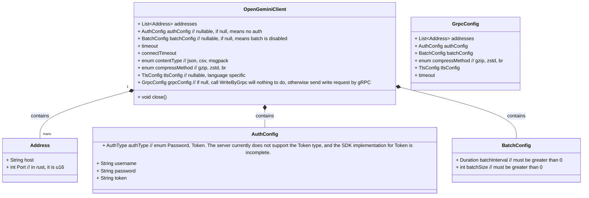
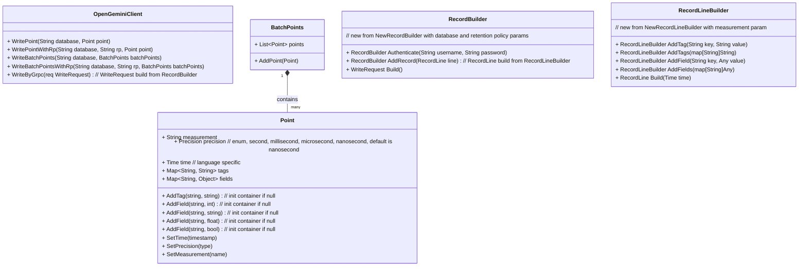
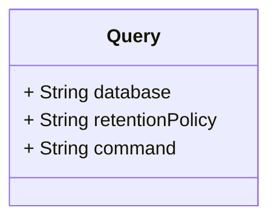
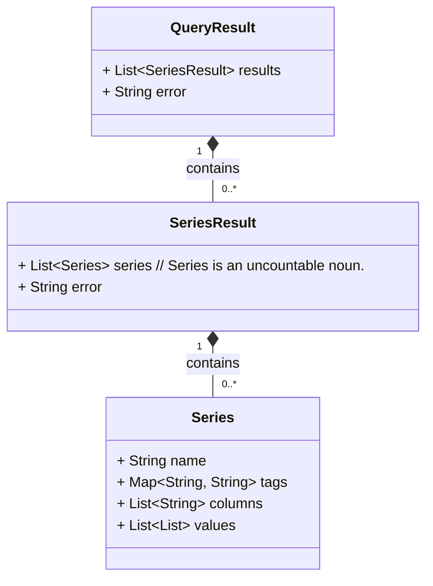
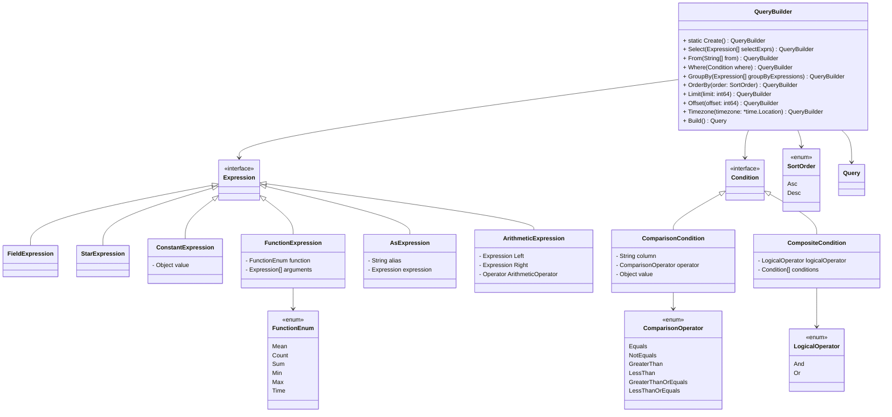
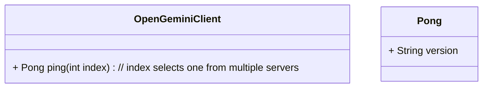
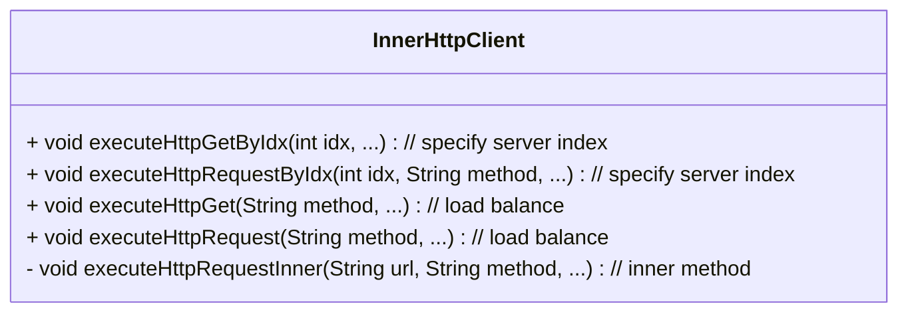
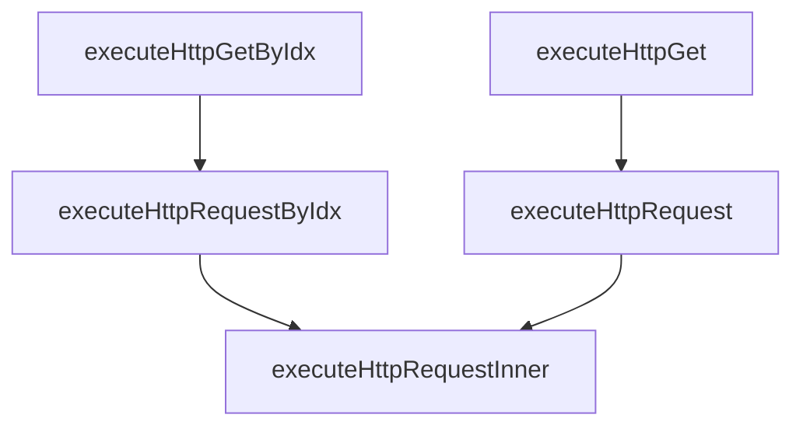

# 背景

由于Influxdb 1.X的客户端已经基本处于维护状态，同时openGemini仍在不断发展中，为了能够更好地支持openGemini，如支持对接多个服务端地址、支持对接Apache
Arrow Flight协议等，社区决定开发属于openGemini自己的客户端SDK。

# 客户端SDK规划功能

- 支持对接多个服务端地址
- 支持对接Apache Arrow Flight协议
- 支持Sql查询、结构化查询、写入、批量写入等，详见下文UML图
- 默认超时，连接超时10秒，读写超时30秒

本文的方法假定编程语言不支持重载，如编程语言支持重载，可以对方法名进行一些优化调整。

# 客户端构造参数设计



# Database & RetentionPolicy管理设计

```mermaid
classDiagram
    class OpenGeminiClient {
        + void CreateDatabase(String database)
        + void CreateDatabaseWithRp(String database, rpConfig RpConfig)
        + String[] ShowDatabases()
        + void DropDatabase(String database)
        + void CreateRetentionPolicy(String database, RpConfig rpConfig, bool isDefault)
        + void UpdateRetentionPolicy(String database, RpConfig rpConfig, bool isDefault)
        + RetentionPolicy[] ShowRetentionPolicies(String database)
        + void DropRetentionPolicy(String database, String retentionPolicy)
        + void CreateMeasurement(CreateMeasurementBuilder builder)
        + String[] ShowMeasurements(ShowMeasurementBuilder builder)
        + void DropMeasurement(String database, String retentionPolicy, String measurement)
        + Map[String]String[] ShowTagKeys(ShowTagKeysBuilder builder)
        + String[] ShowTagValues(ShowTagValuesBuilder builder)
        + Map[String]Map[String]String ShowFieldKeys(String database, Option<String> measurement)
        + String[] ShowSeries(ShowSeriesBuilder builder)
    }
    class RpConfig {
        + String Name // non-null
        + String Duration // non-null
        + String ShardGroupDuration // nullable
        + String IndexDuration // nullable
    }
    class CreateMeasurementBuilder {
        + CreateMeasurementBuilder Tags(String[] tags)
        + CreateMeasurementBuilder FieldMap(map[String]FieldType fields)
        + CreateMeasurementBuilder ShardType(ShardType shardType)
        + CreateMeasurementBuilder ShardKeys(String[] shardKeys)
        + CreateMeasurementBuilder FullTextIndex()
        + CreateMeasurementBuilder IndexList(String[] indexes)
        + CreateMeasurementBuilder EngineType(EngineType engineType)
        + CreateMeasurementBuilder PrimaryKey(String[] primaryKeys)
        + CreateMeasurementBuilder SortKeys(String[] sortKeys)
        + String build()
    }
    class ShowMeasurementBuilder {
        + ShowMeasurementBuilder Filter(ComparisonOperator operator, String regex)
        + String build()
    }
    class FieldType {
        <<enum>>
        Bool  // BOOL
        Int64  // INT64
        Float64 // FLOAT64
        String // STRING
    }
    class ShardType {
        <<enum>>
        Hash // HASH
        Range // RANGE
    }
    class EngineType {
        <<enum>>
        ColumnStore // columnstore
    }
    class ShowTagKeysBuilder {
        ShowTagKeysBuilder Database(String database)
        ShowTagKeysBuilder Measurement(String measurement)
        ShowTagKeysBuilder RetentionPolicy(String rp)
        ShowTagKeysBuilder Limit(int limit)
        ShowTagKeysBuilder Offset(int offset)
    }
    class ShowTagValuesBuilder {
        ShowTagValuesBuilder Database(String database)
        ShowTagValuesBuilder Measurement(String measurement)
        ShowTagValuesBuilder RetentionPolicy(String rp)
        ShowTagValuesBuilder Limit(int limit)
        ShowTagValuesBuilder Offset(int offset)
        ShowTagValuesBuilder With(String[] keys)
        ShowTagValuesBuilder Where(String key, ComparisonOperator operator, String value)
    }
    class ShowSeriesBuilder {
        ShowSeriesBuilder Database(String database)
        ShowSeriesBuilder Measurement(String measurement)
        ShowSeriesBuilder RetentionPolicy(String rp)
        ShowSeriesBuilder Limit(int limit)
        ShowSeriesBuilder Offset(int offset)
        ShowTagValuesBuilder Where(String key, ComparisonOperator operator, String value)
    }
```



# 写入点位设计



# 查询设计





# OpenTelemetry 集成设计
为增强 OpenGemini 客户端的可观测性，便于追踪与查询、写入操作相关的性能指标、错误及其他信息，本方案采用拦截器模式集成 OpenTelemetry，实现全链路追踪。该设计支持非侵入式扩展，允许与其他拦截器（如日志、认证拦截器）共存，同时最大限度减少对原有客户端的修改。
## 拦截器设计
拦截器模式定义了标准化接口，用于挂钩客户端操作（查询/写入）并注入遥测逻辑。

```mermaid
Interceptor interface {
	Query(ctx context.Context, query *InterceptorQuery) InterceptorClosure
	Write(ctx context.Context, write *InterceptorWrite) InterceptorClosure
}
```

## 定义基础客户端类，关联拦截器接口
基础 Client 类管理一组拦截器，允许在客户端操作期间动态注册和执行拦截器逻辑。

```mermaid
class Client {
- []Interceptor interceptors
}
```

## 定义集成 OpenTelemetry 的拦截器实现类，实现 Interceptor 接口
OtelClient 类实现 Interceptor 接口，嵌入 OpenTelemetry 逻辑以捕获客户端操作的跟踪、指标和日志。

```mermaid
class OtelClient {
    Interceptor
}
```

## 追踪系统核心模块

```mermaid
    class TraceContext {
        + traceId: String
        + parentTraceId: String
        + operationName: String
        + timestamp: Long
        + attributes: Map~String, Object~
        + createChildContext() : TraceContext
        + addAttribute(key, value) : void
        + getAttribute(key) : Object
    }

    class ContextManager {
        + getCurrentContext() : TraceContext
        + bindContext(context, task) : void
        + unbindContext() : TraceContext
    }

    class OperationInterceptor {
        <<Interface>>
        + preProcess(operationContext) : void
        + postProcess(operationContext, result) : void
        + errorProcess(operationContext, exception) : void
    }

    class QueryInterceptor {
        + preProcess(operationContext) : void
        + postProcess(operationContext, queryResult) : void
        + errorProcess(operationContext, exception) : void
    }

    class WriteInterceptor {
        + preProcess(operationContext) : void
        + postProcess(operationContext, writeResult) : void
        + errorProcess(operationContext, exception) : void
    }

    class InterceptorChain {
        + interceptors: List~OperationInterceptor~
        + addInterceptor(interceptor) : void
        + executePreFlow(operationContext) : void
        + executePostFlow(operationContext, result) : void
        + executeErrorFlow(operationContext, exception) : void
    }

    class OperationContext {
        + traceContext: TraceContext
        + operationType: Enum~Query/Write~
        + operationParams: Map~String, Object~
        + getTraceContext() : TraceContext
        + setOperationResult(result) : void
    }

    class SDKConfigurator {
        + configureExporter(exporter) : SDKConfigurator
        + configurePropagator(propagator) : SDKConfigurator
        + configureTracerProvider(provider) : SDKConfigurator
        + initialize() : OpenTelemetrySDK
    }

    class TraceExporter {
        <<Interface>>
        + exportTraceData(traceDataList) : void
    }

    class ContextPropagator {
        <<Interface>>
        + inject(traceContext, carrier) : void
        + extract(carrier) : TraceContext
    }

    class TracerProvider {
        + getTracer(name) : Tracer
    }

    class Tracer {
        + createTraceContext(operationName) : TraceContext
        + endTraceContext(traceContext) : void
    }

    class OpenTelemetrySDK {
        + getTracerProvider() : TracerProvider
        + getContextPropagator() : ContextPropagator
        + getTraceExporter() : TraceExporter
    }

    QueryInterceptor ..|> OperationInterceptor
    WriteInterceptor ..|> OperationInterceptor
    InterceptorChain o-- OperationInterceptor : contains
    OperationContext o-- TraceContext : holds
    ContextManager o-- TraceContext : manages

    SDKConfigurator ..> TraceExporter : configures
    SDKConfigurator ..> ContextPropagator : configures
    SDKConfigurator ..> TracerProvider : configures
    SDKConfigurator ..> OpenTelemetrySDK : initializes
    OpenTelemetrySDK o-- TracerProvider : contains
    OpenTelemetrySDK o-- ContextPropagator : contains
    OpenTelemetrySDK o-- TraceExporter : contains
    TracerProvider o-- Tracer : provides
    Tracer ..> TraceContext : creates/ends

    InterceptorChain ..> OperationContext : processes
    Tracer ..> ContextManager : binds context
```

## 使用示例(Go language examples)

```mermaid
func main() {
    var ctx = context.Background()
    shutdown, err := setupOtelSDK(ctx)
    if err != nil {
        return
    }
    defer func() {
        err = errors.Join(err, shutdown(ctx))
    }()

    config := &opengemini.Config{
        Addresses: []opengemini.Address{{
            Host: "127.0.0.1",
            Port: 8086,
        }},
    }
    client, err := opengemini.NewClient(config)
    if err != nil {
        fmt.Println(err)
        return
    }

    client.Interceptors(opengemini.NewOtelInterceptor())

    err = client.CreateDatabase("db0")
    if err != nil {
    }
}
```

# 查询构造器设计



# Ping 设计



# Inner Http client 设计

使用类似InnerHttpClient的设计，将鉴权、负载均衡、重试等逻辑封装在内部，对client提供简单的接口。增强模块化和代码清晰度。





# 错误处理

## 错误信息

### 场景1 http请求失败

```
$operation request failed, error: $error_details
```

### 场景2 http响应码不符合预期

```
$operation error resp, code: $code, body: $body
```

### 场景3 其他异常

```
$operation failed, error: $error_details
# example:
writePoint failed, unmarshall response body error: json: cannot unmarshal number ...
```
